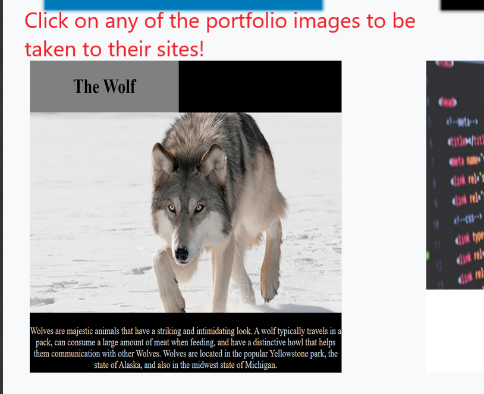

# Responsive_Portfolio

Link to deployed application: https://msnow-21.github.io/Responsive_Portfolio/

Usage: The Response Portofolio has three html sites available. Portfolio, About-Me, and Contact.

The Portfolio site can be accessed by clicking the Portfolio Button in the Navbar

The Contact site can be accessed by clicking the Contact Button in the Navbar

The About Me site can be accessed by clicking the About Me Button in the Navbar

The Navigation bar menu collapses for medium, small, and extra small screen sizes.

Navigation bar open after clicking to view Portfolio, About-Me, and Contact sections.

Contact Me Section submittal details.

Portfolio's can be reached by clicking any of the images.

Description:

The Responsive Portfolio is a website consisting of a Portfolio, About-Me, and Contact page that are created to be responsive for the devices with different viewports. The application gives the user an easy way to look at the Mark Snow's profile, projects that Mark has developed, and a way to contact and connect with Mark. The html files utilize responsive web design through a bootstrap grid system so users can view the Portfolio on a range of devices. Each html file has been formatted using bootstrap technology to use containers to create rows and columns that quickly adapt to the different viewport sizes.

The deployed link immediately takes the user to the About-Me page where a short biography is detailed. The Portfolio and Contact pages can be accessed from this page via the "Portfolio" and "Contact" links available on the Navigation Bar. The Portfolio page provides a list of projects Mark has worked on during his time at Bootcampspot. Projects are shown as pictures acting as clickable links that take the user to those deployed links and Github repositories. The third page is a Contact page that allows the user to contact Mark by submitting their name, e-mail, and a note. The Portfolio and Contact pages both have links in the Navbar that can take you to any of the three pages available. Clicking on "Mark Snow" in the Navbar immediately takes the user home to the About-Me page.

Challenges:

The bootstrap grid proved to be extremely beneficial to this project. Defining columns and rows allow the application to provide visible screens on all devices. As the Portfolio page decreases in pixel size, the images remain at the same size, enabling the user to see and read the same details as a user with a larger screen. Although, beneficial, this proved to be difficult to implement. This involved testing the columns and rows at different widths using development tools to see how the screen reacted at screen size widths.

Another challenge was correctly naming the relative file paths for the images. An image would display locally using Visual Code, however, would not display on GitHub if letters were not capitalized. Differences in the way programs reacted to the code was a challenge and a lesson learned.

Validating the HTML was helpful in identifying unneeded tags, however, also proved challenging with weighing considerations on whether or not to change code. For example, on Index.html, an issue was raised with the h1 tag on line 54 under the article tag. The same tag can be viewed on contact.html, although not under an article tag.

